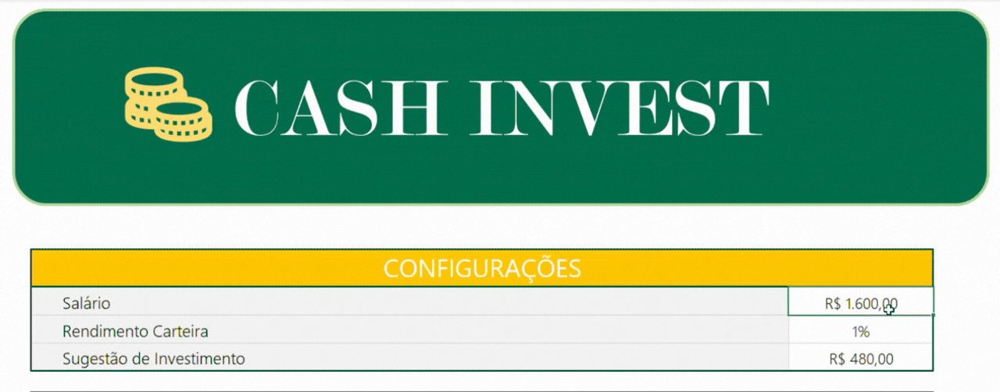
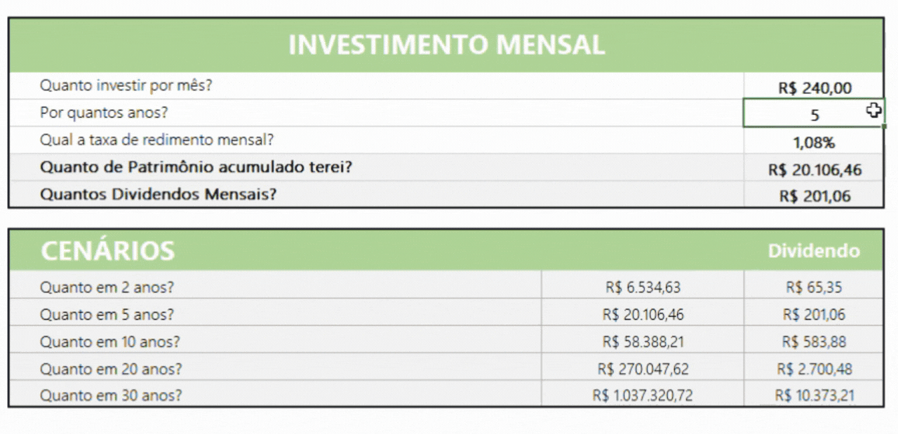
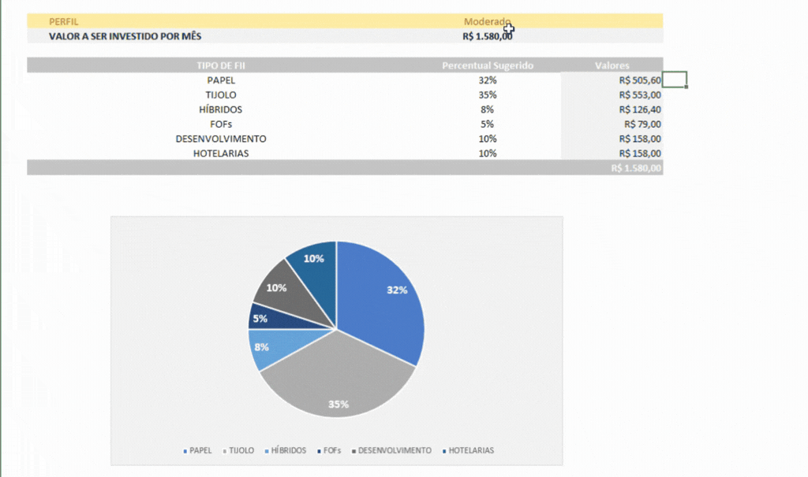
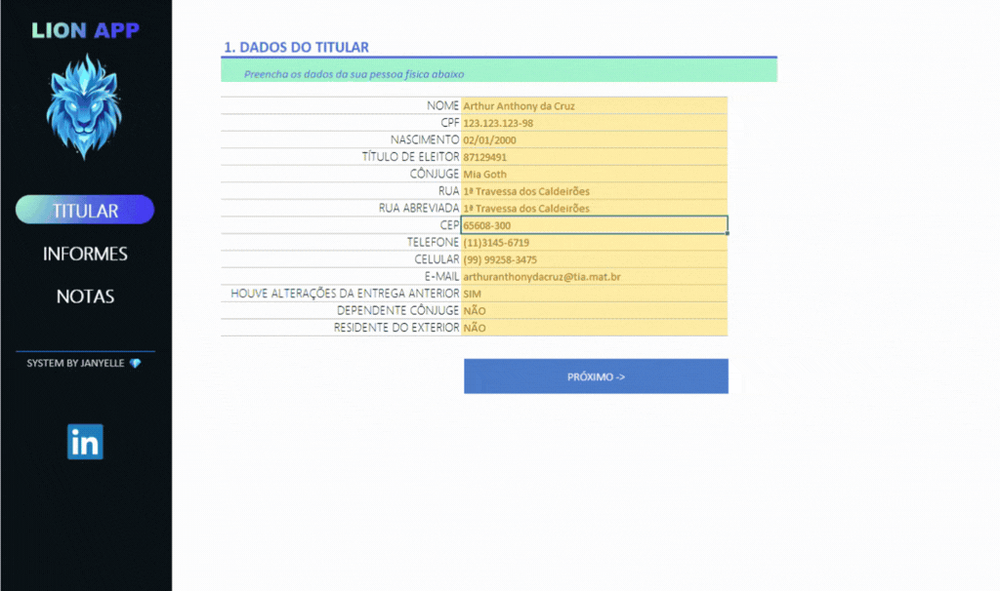
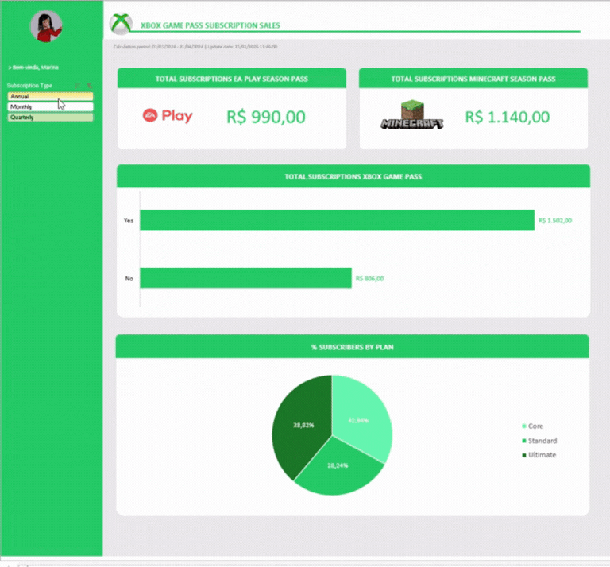

# Projetos – Excel com IA (DIO + Santander)

Este diretório reúne os projetos desenvolvidos durante o curso **Excel com IA**, promovido pela DIO em parceria com o Santander.  
Os projetos têm como foco a aplicação prática do Excel para análise de dados, automação de cálculos e apoio à tomada de decisão.

---

## 1 - Simulador de Controle de Investimentos

### Contexto do Desafio
Este projeto foi desenvolvido com o objetivo de aplicar os conceitos de Excel na construção de uma ferramenta funcional e orientada a um problema real: **a simulação de investimentos em fundos imobiliários (FIIs)**.

O desafio propõe a criação de uma planilha capaz de responder às principais dúvidas de investidores iniciantes, como:
- Quanto investir mensalmente?
- Por quanto tempo investir?
- Qual o impacto da taxa de rendimento no longo prazo?
- Quanto de patrimônio pode ser acumulado ao final do período?

---

## Funcionalidades

- **Sugestão de valor de investimento com base no salário**

  
  
- **Cálculo automático do investimento mensal e projeção de cenários futuros**, considerando aporte, período e taxa de rendimento
  
  
  
- **Seleção do perfil do investidor**, ajustando os parâmetros da simulação
  
  
  

### O que eu aprendi neste projeto
- Fórmulas financeiras
- Variáveis globais
- Definição de nomes em intervalos
- Cálculo de rendimentos e dividendos
- Automação de cálculos no Excel
- Organização de dados para simulação financeira

## 🖇️Arquivo
#### [➡️ Clique aqui para abrir a planilha](Simulador_Controle_de_Investimentos.xlsx)

---

## 2 - Agregador de Dados para Declaração de Imposto de Renda

### Contexto do Desafio
A declaração do imposto de renda exige o controle de diversas informações, como dados do titular, informes de rendimentos e registros adicionais. Pensando nisso, o desafio propôs a criação de uma ferramenta que:
- Centralize todas essas informações em um único arquivo
- Reduza erros por meio de validações automáticas
- Ofereça uma interface amigável, com menus e navegação intuitiva

---

## Funcionalidades

- Menu interativo com botões de navegação
- Telas organizadas por formulário, facilitando o preenchimento
- Validação automática de dados para evitar erros de entrada
- Formatação de campos para padronização das informações
- Links rápidos para navegação entre as seções

## Estrutura

A planilha foi organizada em formulários específicos:
- **Formulário do Titular:** Cadastro dos dados principais do contribuinte
- **Informes de Rendimentos:** Registro e controle das fontes de renda
- **Notas e Registros Adicionais** Espaço destinado aos valores de entrada mês a mês

### O que eu aprendi neste projeto
- Formatação condicional
- Validação de dados
- Criação de botões e menus interativos
- Organização lógica das informações
- Automação de processos dentro do Excel

## 🖇️Arquivo
#### [➡️ Clique aqui para abrir a planilha](Agregador_de_Dados_IR.xlsx)

---

## 3 - Dashboard de Vendas do Xbox

### Contexto do Desafio
Este projeto teve como objetivo aplicar técnicas avançadas de tratamento de dados, automação com IA e criação de dashboards profissionais no Excel.
Recebemos uma base com dados inconsistentes e valores faltantes, e o desafio foi corrigir, padronizar, enriquecer e transformar esses dados em um painel interativo que facilitasse a análise dos principais indicadores das assinaturas do Xbox.

---

## Funcionalidades

- Correção automática da base de dados com regras definidas (Plan, Subscription Price, EA Play, Minecraft Pass etc.)
- Cálculo automatizado de valores
- Normalização de campos
- Resumo automático de cálculos para apoio à análise
- Dashboard interativo
- Proteção da planilha, permitindo apenas interação nos filtros

## Estrutura
- Bases – tabela corrigida e padronizada
- Cálculos – resumo das métricas principais
- Dashboard – painel com gráficos e indicadores
- Assets – paleta de cores e elementos visuais

## Dashboard Final

### O que eu aprendi neste projeto
- Limpeza e padronização de dados
- Construção de lógica de negócio dentro do Excel
- Uso de Tabelas e Tabelas Dinâmicas
- Criação de dashboards profissionais
- Proteção e usabilidade

## 🖇️Arquivo
#### [➡️ Clique aqui para abrir o Dashboard](Dashboard_Vendas_Xbox.xlsx)

---

